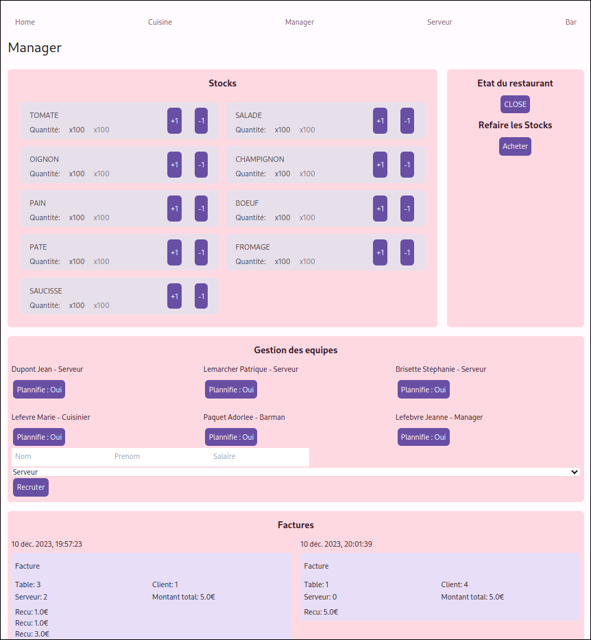
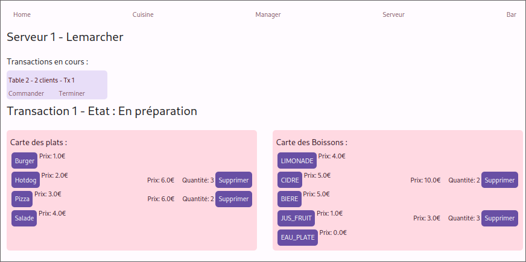
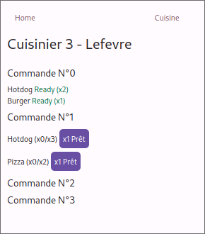
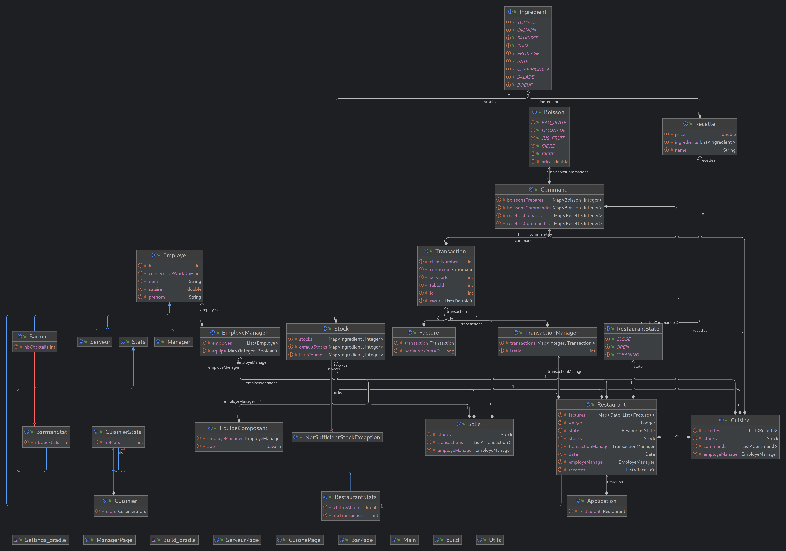

# Krusty Kraber

Une application de gestion de restaurant avec une interface web.

Capable de :

- Gérer les stocks
- Gérer les employés 
- Gérer les commandes
- Gérer les clients  

## Équipe

- Nathan Eudeline
- Sacha Evain
- Yassine Chiadmi

### Répartition des tâches

#### Nathan

Il s'est concentré sur la partie backend de l'application, en particulier sur la gestion des stocks, des employés et des transactions, ainsi que sur la partie web avec l'API et le serveur web.

#### Sacha

A mis en place la partie web de l'application, en particulier l'interface graphique et les interactions avec l'API.

#### Yassine

Il s'est occupé du design de l'application, en particulier le CSS et la mise en page de l'interface graphique.

## Installation

bashCopy code

`git clone https://github.com/Bafbi/Krusty-Kraber.git`

Save to grepper

## Usage

Pour simplifier le développement et le processus de build, nous avons utilisé [gradle](https://gradle.org/install/) pour gérer les dépendances et lancer l'application.

bashCopy code

`cd Krusty-Kraber
gradle run`

Save to grepper

L'application est ensuite accessible à l'adresse [http://localhost:8080](http://localhost:8080/).

## Fonctionnement

### Architecture

L'application est basée sur une classe principale `Restaurant` qui contient les différentes listes d'objets (employés, transactions, stocks, ...) et qui est complètement séparée de l'interface graphique. Ensuite, il y a une classe `Application` qui introduit un serveur web, permettant ainsi la communication avec l'interface graphique.

### Interface

Pour l'interface, nous utilisons directement un navigateur web. Pour cela, nous avons un serveur web à l'aide de la librairie [Javalin](https://javalin.io/) et utilisons [</> htmx](https://htmx.org/) pour l'interactivité de notre interface utilisateur sans avoir besoin d'écrire du JavaScript. Notre HTML est généré à l'aide de [J2Html](https://j2html.com/), nous permettant de générer du HTML à partir de Java. De plus, [Tailwind CSS](https://tailwindcss.com/) a été utilisé pour simplifier le CSS. Cela nous permet d'avoir une interface graphique complètement séparée de notre application. Du côté du développement, cela est plus simple à gérer car tout est dans notre Java et il n'y a pas de JavaScript.

### L'application

Notre classe `Restaurant` contient les différents 'modules' dont nous avons besoin pour faire fonctionner notre restaurant :

- `Stock`, qui contient les différents `Ingrédients` et les quantités disponibles, ainsi qu'un stock par défaut qui nous permet de remplir à nouveau les stocks.
- `EmployeManager`, qui contient les différents `Employés` et indique s'ils sont planifiés ou non.
- `TransactionManager`, qui contient les différentes `Transactions` et leur `Commande` associée.
- `List<Recette>`, qui contient les différentes `Recettes` du restaurant.

Les `Commandes` fonctionnent à l'aide de plusieurs `Map<?, Integer>` qui vont contenir les Recettes/Boissons et leurs quantités, ainsi que les Recettes/Boissons qui ont été préparées.

## Améliorations

Pris par le temps et la complexité du projet, nous n'avons pas pu implémenter toutes les fonctionnalités que nous voulions. Voici une liste des améliorations que nous aurions pu faire :

- Utiliser les websockets pour mettre à jour l'interface en temps réel
- Ajouter des tests unitaires
- Sécuriser les routes de l'API pour les requêtes faites sans passer par l'interface
- Ajouter un système de login pour les employés
- Gérer les statistiques des employés et du restaurant
- Améliorer le design de l'interface (UX et UI)

## Conclusion

Ce projet a permis de mettre en pratique les connaissances acquises en cours de Java, et même d'aller plus loin en introduisant des notions de programmation web. Nous avons pu découvrir de nouvelles librairies et de nouvelles façons de créer des applications. Nous avons aussi pu découvrir les difficultés de travailler en groupe sur un projet de cette envergure.